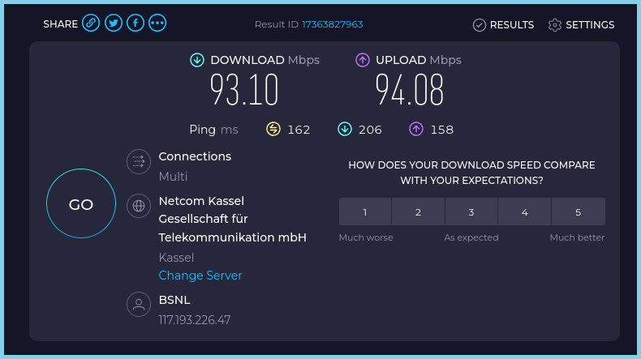

# tor_scoks_proxy

Tor SOCKS proxy routes traffic through the Tor network for anonymity.
How to use Tor SOCKS into firefox


**1st need to install**

```
sudo apt-get install tor obfs4proxy

```


**Create a configuration file for Tor bridges:**

```
sudo nano /etc/tor/torrc
```


**then paste and save it.**


```
/etc/tor/torrc
```


**How to get tor Bridges:**


go to tele bot


https://t.me/GetBridgesBot

or

https://bridges.torproject.org/bridges?transport=obfs4


```
obfs4 95.216.21.221:34233 EC31349E0DD564CB12283CEB52D5D66B2AFEB491 cert=dO8LYOJwwXIG5JWBik9NJWvRj5mGHodZLOE2wmzp3D/4lLLzvz4cQtkhBX/sFuJgZtZsUg iat-mode=0
obfs4 193.30.120.139:40480 576B60FADB228447DD4E46D89CA12B4F4C70A94B cert=DEvknXT0msOo2buXWfkRMCzQeOWZggjWhDXhU4FRt9qfGssb6n5nbVpGC1w8PN701qONDw iat-mode=0
```


```

UseBridges 1
ClientTransportPlugin obfs4 exec /usr/bin/obfs4proxy
Bridge obfs4 65.109.172.40:26101 B2313F3150F1D17C438C9A450B39720BC142E694 cert=4o+I2rET2wZwhm0z5S5a/tOP8Q3IN6KfgASXNcvIqceeBKn75bawiQWTCwNrGSksaLtcEg iat-mode=0
Bridge obfs4 142.132.228.40:26712 6C9239B5F684285E6561F0EE680997112163D0C2 cert=yWi6LBrn/Gcq5Kns+IxSqdYpIHfC/7KQNt99bJiIZOKz9dApp6AHo1CWLoA6zJQOCm9bMw iat-mode=0

Log notice file /var/log/tor/notices.log


# Additional Configuration
# In the Tor configuration file (/etc/tor/torrc), you can specify the SOCKS port and other settings:

SocksPort 9050

```


**need to restart**

```
sudo systemctl restart tor
```


**check the status**

```
sudo systemctl status tor
```


**for troubleshooting**


Verify Tor is using the bridges:
Check the Tor logs to ensure it is using the bridges correctly:

```
sudo journalctl -u tor
```


**Check if the Tor configuration is valid:**

```
sudo tor -f /etc/tor/torrc --verify-config
sudo dmesg | grep tor
```


**Correct permissions for configuration files and log directories:**

```
sudo chown -R tor:tor /var/log/tor /etc/tor
```


**Correct permissions for configuration file torrc**


```
-rw-r--r--  1 root root 9777 Feb 11 14:02 torrc


-rw-r--r-- (Symbolic Representation)

    - → Regular file
    rw- (Owner) → Read & Write (6)
    r-- (Group) → Read-only (4)
    r-- (Others) → Read-only (4)

Equivalent Octal Representation

Each permission group (owner, group, others) is converted to octal:

    rw- = 6 (Read = 4, Write = 2, Execute = 0 → 4+2+0)
    r-- = 4 (Read = 4, Write = 0, Execute = 0 → 4+0+0)
    r-- = 4 (Same as above)

So, -rw-r--r-- = 644 in octal.


```


**Configuring Firefox to Use SOCKS5 Proxy**

```
Open Firefox:
Launch your Firefox browser.


Access Network Settings:

    Click the menu button (three horizontal lines) in the top-right corner of Firefox.
    Select Settings (or Options on some systems).
    Scroll down to the Network Settings section and click Settings.
    
    
Configure Proxy Settings:

    Select Manual proxy configuration.
    
    
SOCKS Host: localhost
Port: 9050

```


```
about:preferences#general -->  Settings

```


**`FIREFOX CONFIG:`**


**`FIREFOX HTTPS TEST:`**


**test socks verification**


```
localhost:9050
```


**Verify IP Address**

Visit a site like check.torproject.org to verify that you are using Tor and that your IP address is masked.

https://check.torproject.org/


Check for DNS Leaks:

Ensure there are no DNS or WebRTC leaks by visiting dnsleaktest.com and checking your WebRTC settings.

https://www.dnsleaktest.com/


**CLI_test**


```
# torify:
torify curl https://check.torproject.org/ | grep -i "use Tor"

# torsocks:
torsocks curl https://check.torproject.org/
```


**`WITH OUT TOR HTTPS TEST:`**


**`TOR TEST:`**


**`DNS TEST AFTER:`**


**`SPEED TEST:`**




**`SPEED WITH TOR SOCKS TEST:`**


**DAY_FEB_11_2025**


```
obfs4 91.134.55.73:36233 3CB1AF12EE128DBDF68444C26259AECEAA3B6A07 cert=OJf7i21V9+ZJBG5kOv5RdAxyS9G6o52F+Z/EoY5wPKpTIVyZTFi5/6fWNeJsuHCr9OABPg iat-mode=0
obfs4 51.83.252.70:18309 7FA5CCF98172F8E4073ED331FD86406D80E1C95D cert=+F3w/iZJY1cHXbyrapP8YSRrGAISByYkmuWYECWGlRSCTyQeDaeYabCIyrwjRMcR23v8Rg iat-mode=0
```


**ImageMagick to add a 5px skyblue border to src/ image**


```
sudo apt install imagemagick
chmod +x add_border.sh
./add_border.sh
```

 
 


